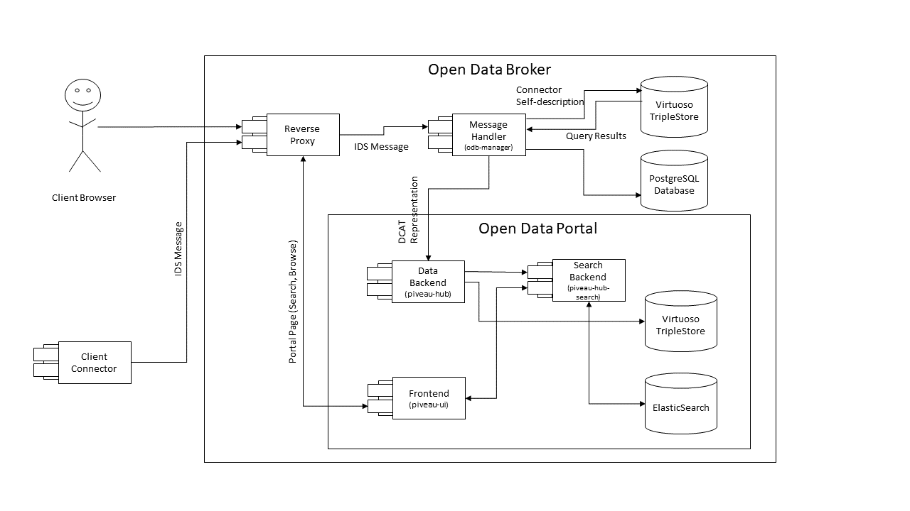

# IDS Open Data Broker

This is the Repository collecting setup files to conveniently boot an instance of the IDS Open Data Broker via docker-compose.
The IDS Open Data Broker is a **work in progress**. Please contribute by reporting issues.

More information and related projects are available at

* https://www.internationaldataspaces.org/

* https://www.internationaldataspaces.org/wp-content/uploads/2019/07/Open-Data-Spaces-IDSA.pdf

* https://www.youtube.com/watch?v=6v-pcnAHh6A

* https://github.com/industrial-data-space/

## Requirements
* git
* docker
* docker-compose 3.5 or higher

## Starting the Broker

### Using prebuild images (recommended)

To start the broker manually run:

```sh start.sh [-t]``` 

The -t parameter specifies the wait time between initialisation of important containers. It defaults to 10 seconds, but may be lowered depending on the machine the broker is run on.

The broker can also be started using docker-compose up -d. However due to initialization times of containers, errors may occur. We therefore recommend using the startup script.

### Building the broker from source
* Follow the instructions in the components repositories to build the components
* It is recommended to use the provided docker-compose.yml as it includes all the necessary default configurations
* Replace the images provided in the docker-compose.yml with the docker images created during building the components 
* run ```sh start.sh [-t]``` 

The -t parameter specifies the wait time between initialisation of important containers. It defaults to 10 seconds, but may be lowered depending on the machine the broker is run on.

The broker can also be started using docker-compose up -d. However due to initialization times of containers, errors may occur. We therefore recommend using the startup script.

## Architecture


The diagram above provides an overview of the components of the Open Data Broker. 
It consists of a managing component, receiving and orchestrating the IDS Messages, and the Open Data Platform infrastructure based on piveau.
The IDS Connector Self Description is stored in a virtuoso triplestore to enable querying via SPARQL.
The piveau-hub receives the IDS metadata as DCAT compliant RDF and provides storage of the information to enable search (piveau-hub-search using elasticsearch) and visualization via the piveau-ui frontend.

## Usage
* The broker self description can be accessed at localhost
* IDS infrastructure messages can be send via HTTP POST to localhost/infrastructure
* IDS Query messages can be send via HTTP POST to localhost/data
* Frontend is available at localhost/browse
* piveau backend is available at localhost/api/hub
* piveau search is available at localhost/api/search

### Registering Metadata at the Broker
See the ids-open-data-connector documentation on how to set up an Open Data Conector, registering to a broker and publishing Open Data.
